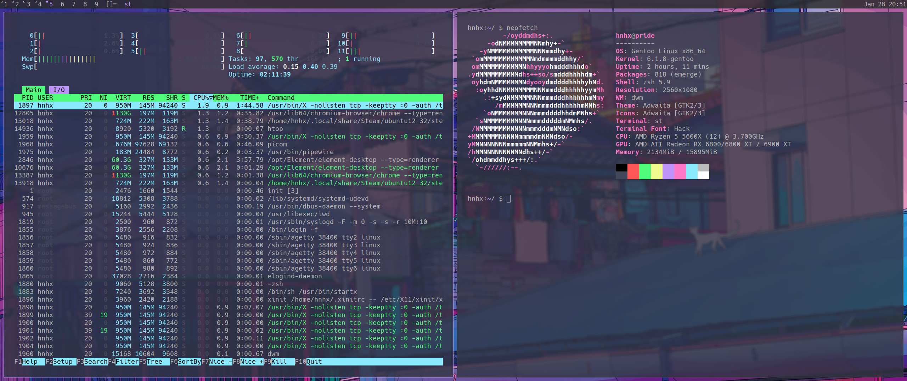

<p align="center">My simple suckless rice</p>

<br>

How to install:

```
git clone https://github.com/hnhx/rice.git
cd rice
make
sudo make install
chsh -s /bin/zsh (if zsh is not your default shell already)
```

The packages you will need: `zsh xclip scrot dmenu feh sxhkd picom hack (font)`